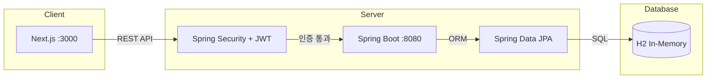
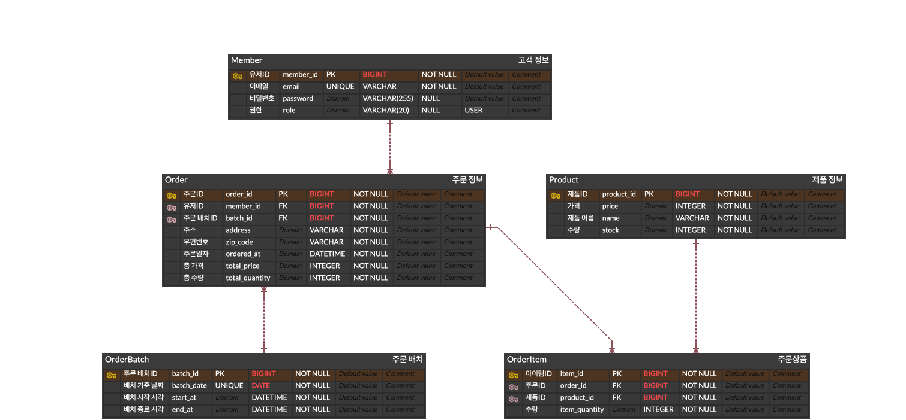

# ☕ GC-Coffee (Grids & Circles)

커피 원두 온라인 주문 관리 서비스

## 📌 프로젝트 소개

로컬 카페 Grids & Circles의 온라인 원두 패키지 주문 시스템입니다. 고객은 웹사이트에서 커피 원두를 선택하고 주문하며, 매일 오후 2시를 기준으로 배송합니다.

- **기간**: 2026.03.19 ~ 2026.03.26 (1주)
- **인원**: 6명

## 📊 프로젝트 통계

  

## 🛠️ 기술 스택

### Backend
  

### Frontend
   

### Database
  

### 협업
   

## 🏛️ 시스템 아키텍처



## 📊 ERD



### 테이블 구조
- **Member**: 고객 정보 (이메일, 권한)
- **Product**: 상품 정보 (이름, 가격, 재고)
- **Order**: 주문 정보 (주소, 총액, 주문일시)
- **OrderBatch**: 배치 정보 (배치 날짜, 시작/종료 시각)
- **OrderItem**: 주문 상품 (주문-상품 중간 테이블)

### 주요 관계
- Member 1 : N Order
- OrderBatch 1 : N Order
- Order 1 : N OrderItem (양방향)
- Product 1 : N OrderItem

## 🚀 주요 기능

### 고객
- 상품 목록 조회 (페이징, 정렬, 검색)
- 장바구니 (React Context 기반 상태 관리)
- 이메일 기반 주문 생성 (재고 차감, 트랜잭션 처리)
- 주문 완료 확인

### 관리자
- JWT 기반 관리자 인증
- 상품 등록 / 수정 / 삭제
- 전체 주문 조회 (신규 주문 표시)

### 시스템
- 오후 2시 기준 배치 자동 배정
- 이메일 기반 고객 자동 생성 (getOrCreate)

## 📡 API 명세

| HTTP | Path | 설명 |
|------|------|------|
| `POST` | `/api/v1/members` | 고객 조회/생성 |
| `GET` | `/api/v1/products` | 상품 목록 |
| `GET` | `/api/v1/products/{productId}/stock` | 재고 조회 |
| `POST` | `/api/v1/admin/products` | 상품 등록 |
| `PUT` | `/api/v1/admin/products/{productId}` | 상품 수정 |
| `DELETE` | `/api/v1/admin/products/{productId}` | 상품 삭제 |
| `POST` | `/api/v1/orders` | 주문 생성 |
| `GET` | `/api/v1/orders/{orderId}` | 주문 상세 |
| `GET` | `/api/v1/admin/orders` | 전체 주문 조회 |
| `POST` | `/api/v1/admin/batch` | 배치 생성 |
| `GET` | `/api/v1/admin/batch` | 배치 목록 조회 |
| `GET` | `/api/v1/admin/batch/{orderBatchId}` | 배치 상세 조회 |
| `GET` | `/api/v1/admin/batch/current` | 현재 배치 조회 |
| `GET` | `/api/v1/admin/batch/{orderBatchId}` | 배치 삭제 |
| `GET` | `/api/v1/members/login` | 관리자 로그인 |

## 🏗️ 프로젝트 구조

### Backend
```
src/main/java/com/gridsandcircles/gc_coffee/
├── entity/          # Entity 클래스
├── global/          # 공통 설정 (ApiResponse, CORS, ExceptionHandler)
├── product/         # 상품 도메인
├── member/          # 고객, 관리자 도메인
├── order/           # 주문 도메인
└── stock/           # 재고 도메인
```

### Frontend
```
src/
├── app/
│   ├── admin/       # 관리자 페이지
│   ├── api/         # API 호출 함수
│   ├── components/  # 컴포넌트 (ProductList, Cart, OrderForm)
│   ├── context/     # React Context (CartContext, AuthContext)
│   ├── login/       # 로그인 페이지
│   ├── orders/      # 주문 결과 페이지
│   ├── type/        # 타입 정의
│   ├── layout.tsx   # 공통 레이아웃
│   └── page.tsx     # 메인 페이지
```

## 👥 팀원 역할

| 팀원 | 역할 |
|------|------|
| 정준용 (팀장) | 공통 인프라 (ApiResponse, CORS, ExceptionHandler), 프론트 공통 레이아웃, 컴포넌트, 코드 리뷰, 최종 리팩토링 |
| 이도훈 | 주문 생성 API(장바구니 주문 전환 시 트랜잭션 처리 로직), 주문 상세 조회, 주문서 작성 폼, 주문 결과 페이지 |
| 황지윤 | 상품 목록 조회 API (페이징, 정렬, 검색), 상품 리스트 그리드 UI, 메인 페이지 UI |
| 장재원 | 관리자 상품 CRUD, 고객 API, JWT 기반 관리자 로그인, 관리자 페이지 레이아웃, 상품 등록/수정 폼 |
| 조보강 | 주문 마감 자동화 시스템, 동일 고객/배치 기준 주문 병합 알고리즘, 관리자 주문 내역 테이블 UI |
| 조우진 | 재고 조회, 확인 API, 재고 차감 요청 기능, 장바구니 전역 상태 관리(React Context), 장바구니 페이지 UI(수량 변경, 삭제, 합계, 재고 초과 체크) |

## 🔧 실행 방법

### Backend
```bash
cd backend
./gradlew bootRun
# http://localhost:8080
```

### Frontend
```bash
cd frontend
npm install
npm run dev
# http://localhost:3000
```

## 📝 브랜치 전략


- 이슈 기반 브랜치 관리 (`feat/#이슈번호-기능명`)
- PR 리뷰 후 squash merge
- dev → main 최종 머지
